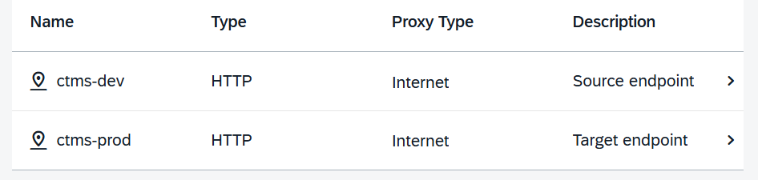

# Creating Destinations Using SAP Cloud Deployment Service

To address the target end point of the deployment process of MTA Deployment on Cloud Foundry, you can create a destination to SAP Cloud Deployment service with **Basic Authentication** or **OAuth2Password Authentication**.

Create two destinations representing the source (DEV) and the target (PROD) endpoints. After creation, they should look like this:

## Procedure

1.  In SAP BTP Cockpit of your subaccount, choose _Connectivity_ \> _Destinations_.

2.  In the _Destinations_ editor, choose _Create_ \> _From Scratch_ \> _Create_.

3.  Enter or select the following values for Basic Authentication (3.1) or OAuth2Password Authentication (3.2):

    3.1. Basic Authentication:

    ## MTA Deployment on Cloud Foundry with Classic Basic Authentication

    <table>
    <tr>
    <th valign="top">

    Field

    </th>
    <th valign="top">

    Description

    </th>
    <th valign="top">

    More Information

    </th>
    </tr>
    <tr>
    <td valign="top">

    _Name_

    </td>
    <td valign="top">

    Name of the destination

    </td>
    <td valign="top" rowspan="4">

    SAP BTP, Cloud Foundry: [Using the Destinations Editor in the Cockpit](https://help.sap.com/docs/CP_CONNECTIVITY/cca91383641e40ffbe03bdc78f00f681/565fdb3dd19d4cda80864341dc5a0451.html)

    </td>
    </tr>
    <tr>
    <td valign="top">

    _Type_

    </td>
    <td valign="top">

    _HTTP_

    </td>
    </tr>
    <tr>
    <td valign="top">

    _Description_

    </td>
    <td valign="top">

    The description of the destination is optional.

    </td>
    </tr>
    <tr>
    <td valign="top">

    _Proxy Type_

    </td>
    <td valign="top">

    _Internet_

    </td>
    </tr>
    <tr>
    <td valign="top">

    _URL_

    </td>
    <td valign="top">

    Specify the URL to the SAP Cloud Deployment service as the deploy end point of the destination. To address the SAP Cloud Deployment service, you have the following options:
    - **Using the names of your org and space**

      <code>https://deploy-service.cf.<i class="varname">&lt;domain&gt;</i>/slprot/<i class="varname">&lt;myorg&gt;</i>/<i class="varname">&lt;myspace&gt;</i>/slp</code>
      - <code><i class="varname">&lt;domain&gt;</i></code>: Domain of your target subaccount

        The domain is derived from the Cloud Foundry API endpoint that you can find in the SAP BTP Cockpit in the _Overview_ of your subaccount.

      - <code><i class="varname">&lt;myorg&gt;</i>/<i class="varname">&lt;myspace&gt;</i></code>: Names of your org and space

        > ### Note:
        >
        > You need to escape special characters in your org and space name \(_<myorg\>_/_<myspace\>_\) with a proper URL encoding. For example, replace space characters with `%20`, and commas with `%2C`.

      > ### Example:
      >
      > - Sample URL for the Cloud Foundry API endpoint: `api.cf.eu10-004.hana.ondemand.com`, <code><i class="varname">&lt;myorg&gt;</i></code>: `TestOrg`, and <code><i class="varname">&lt;myspace&gt;</i></code>: `TestSpace`:
      >
      >   `https://deploy-service.cf.eu10-004.hana.ondemand.com/slprot/TestOrg/TestSpace/slp`
      >
      > - Sample URL with URL encoding for <code><i class="varname">&lt;myorg&gt;</i></code>: `Example Company Test Org` and <code><i class="varname">&lt;myspace&gt;</i></code>: `Example Company Test Space`:
      >
      >   `https://deploy-service.cf.eu10-004.hana.ondemand.com/slprot/Example%20Company%20Test%20Org/Example%20Company%20Test%20Space/slp`

    - **Using the GUID of your space**

      <code>https://deploy-service.cf.<i class="varname">&lt;domain&gt;</i>/slprot/<i class="varname">&lt;my-space-guid&gt;</i>/slp</code>
      - <code><i class="varname">&lt;domain&gt;</i></code>: Domain of your subaccount

        The domain is derived from the Cloud Foundry API endpoint that you can find in the SAP BTP Cockpit in the _Overview_ of your subaccount.

      - <code><i class="varname">&lt;my-space-guid&gt;</i></code>: GUID of your space

        To retrieve the GUID of your space, use the Cloud Foundry Command Line Interface \(cf CLI\). Log on to your org, and execute the following command: `cf space <my-space-name> --guid`.

      > ### Example:
      >
      > Sample URL for the Cloud Foundry API endpoint: `api.cf.eu10-004.hana.ondemand.com` and <code><i class="varname">&lt;my-space-guid&gt;</i></code>: `977a24d6-2eaf-432d-a3e1-5294451551a3`:
      >
      > `https://deploy-service.cf.eu10-004.hana.ondemand.com/slprot/977a24d6-2eaf-432d-a3e1-5294451551a3/slp`

    </td>
    <td valign="top">

    More information about regions and API endpoints:
    - [Deploying Applications in Regions](https://help.sap.com/docs/BTP/65de2977205c403bbc107264b8eccf4b/350356d1dc314d3199dca15bd2ab9b0e.html?locale=en-US#deploying-applications-in-regions)

    - [Regions and API Endpoints Available for the Cloud Foundry Environment](https://help.sap.com/docs/BTP/65de2977205c403bbc107264b8eccf4b/f344a57233d34199b2123b9620d0bb41.html?locale=en-US).

    More information about cf CLI:
    - [Working with the Cloud Foundry Command Line Interface](https://help.sap.com/docs/BTP/65de2977205c403bbc107264b8eccf4b/2f1d4abd0f9f4760a301f43513d2efa6.html?locale=en-US)

    </td>
    </tr>
    <tr>
    <td valign="top">

    _Authentication_

    </td>
    <td valign="top">

    Select _BasicAuthentication_.

    </td>
    <td valign="top" rowspan="3">

    [Client Authentication Types for HTTP Destinations](https://help.sap.com/docs/CP_CONNECTIVITY/cca91383641e40ffbe03bdc78f00f681/4e13a04147314e8e9e54321f25d93fdc.html?locale=en-US)

    </td>
    </tr>
    <tr>
    <td valign="top">

    _User_

    </td>
    <td valign="top">

    Specify the user name \(usually, an email address\) of the user that is used for the deployment.

    > ### Note:
    >
    > - The user used for the destination must be a valid user on Cloud Foundry environment and it must have the role `SpaceDeveloper` in the target space.
    > - The user must be a platform user so that the deployment works for all content types. For more information, see [Platform Users](https://help.sap.com/docs/btp/sap-business-technology-platform/platform-users).
    > - The user used for the destination isn’t subject to any Data Protection and Privacy requirements.
    > - We recommend that you use a technical user to avoid constraints typically associated with personal users, such as password rotation.

    > ### Restriction:
    >
    > Basic Authentication only works with users provided by SAP ID. It does not work with custom IAS tenant users. If you want to use a custom identity provider for the platform user used for the deployment, you must use OAuth2Password authentication for the destination. For more information, see `Destination Settings for MTA Deployment on Cloud Foundry with OAuth2Password Authentication`.

    </td>
    </tr>
    <tr>
    <td valign="top">

    _Password_

    </td>
    <td valign="top">

    Specify the password of the user.

    </td>
    </tr>

    <tr>
    <td valign="top">

    _Use default client truststore_

    </td>
    <td valign="top">

    This checkbox is selected by default.

    If you leave the checkbox selected, the default client truststore with certificates provided by SAP are used.

    If you want to change this, see [Use Destination Certificates \(Cockpit\)](https://help.sap.com/docs/CP_CONNECTIVITY/b865ed651e414196b39f8922db2122c7/d3dfd5052fb14a15aad87ebcdb2f23e2.html?locale=en-US).

    </td>
    <td valign="top">

     

    </td>
    </tr>
    </table>

    ***

    3.2. OAuth2Password Authentication:

    ## Destination Settings for MTA Deployment on Cloud Foundry with OAuth2Password Authentication

    <table>
    <tr>
    <th valign="top">

    Field

    </th>
    <th valign="top">

    Description

    </th>
    <th valign="top">

    More Information

    </th>
    </tr>
    <tr>
    <td valign="top">

    _Name_

    </td>
    <td valign="top">

    Name of the destination

    </td>
    <td valign="top" rowspan="4">

    SAP BTP, Cloud Foundry: [Using the Destinations Editor in the Cockpit](https://help.sap.com/docs/CP_CONNECTIVITY/cca91383641e40ffbe03bdc78f00f681/565fdb3dd19d4cda80864341dc5a0451.html)

    </td>
    </tr>
    <tr>
    <td valign="top">

    _Type_

    </td>
    <td valign="top">

    _HTTP_

    </td>
    </tr>
    <tr>
    <td valign="top">

    _Description_

    </td>
    <td valign="top">

    The description of the destination is optional.

    </td>
    </tr>
    <tr>
    <td valign="top">

    _Proxy Type_

    </td>
    <td valign="top">

    _Internet_

    </td>
    </tr>
    <tr>
    <td valign="top">

    _URL_

    </td>
    <td valign="top">

    Specify the URL to the SAP Cloud Deployment service as the deploy end point of the destination. To address the SAP Cloud Deployment service, you have the following options:
    - **Using the names of your org and space**

      <code>https://deploy-service.cf.<i class="varname">&lt;domain&gt;</i>/slprot/<i class="varname">&lt;myorg&gt;</i>/<i class="varname">&lt;myspace&gt;</i>/slp</code>
      - <code><i class="varname">&lt;domain&gt;</i></code>: Domain of your target subaccount

        The domain is derived from the Cloud Foundry API endpoint that you can find in the SAP BTP Cockpit in the _Overview_ of your subaccount.

      - <code><i class="varname">&lt;myorg&gt;</i>/<i class="varname">&lt;myspace&gt;</i></code>: Names of your org and space

        > ### Note:
        >
        > You must escape special characters in your org and space name \(_<myorg\>_/_<myspace\>_\) with a proper URL encoding. For example, replace space characters with `%20`, and commas with `%2C`.

      > ### Example:
      >
      > - Sample URL for the Cloud Foundry API endpoint: `api.cf.eu10-004.hana.ondemand.com`, <code><i class="varname">&lt;myorg&gt;</i></code>: `TestOrg`, and <code><i class="varname">&lt;myspace&gt;</i></code>: `TestSpace`:
      >
      >   `https://deploy-service.cf.eu10-004.hana.ondemand.com/slprot/TestOrg/TestSpace/slp`
      >
      > - Sample URL with URL encoding for <code><i class="varname">&lt;myorg&gt;</i></code>: `Example Company Test Org` and <code><i class="varname">&lt;myspace&gt;</i></code>: `Example Company Test Space`:
      >
      >   `https://deploy-service.cf.eu10-004.hana.ondemand.com/slprot/Example%20Company%20Test%20Org/Example%20Company%20Test%20Space/slp`

    - **Using the GUID of your space**

      <code>https://deploy-service.cf.<i class="varname">&lt;domain&gt;</i>/slprot/<i class="varname">&lt;my-space-guid&gt;</i>/slp</code>
      - <code><i class="varname">&lt;domain&gt;</i></code>: Domain of your subaccount

        The domain is derived from the Cloud Foundry API endpoint that you can find in the SAP BTP Cockpit in the _Overview_ of your subaccount.

      - <code><i class="varname">&lt;my-space-guid&gt;</i></code>: GUID of your space

        To retrieve the GUID of your space, use the Cloud Foundry Command Line Interface \(cf CLI\). Log on to your org, and execute the following command: `cf space <my-space-name> --guid`.

      > ### Example:
      >
      > Sample URL for the Cloud Foundry API endpoint: `api.cf.eu10-004.hana.ondemand.com` and <code><i class="varname">&lt;my-space-guid&gt;</i></code>: `977a24d6-2eaf-432d-a3e1-5294451551a3`:
      >
      > `https://deploy-service.cf.eu10-004.hana.ondemand.com/slprot/977a24d6-2eaf-432d-a3e1-5294451551a3/slp`

    </td>
    <td valign="top">

    More information about regions and API endpoints:
    - [Deploying Applications in Regions](https://help.sap.com/docs/BTP/65de2977205c403bbc107264b8eccf4b/350356d1dc314d3199dca15bd2ab9b0e.html?locale=en-US#deploying-applications-in-regions)

    - [Regions and API Endpoints Available for the Cloud Foundry Environment](https://help.sap.com/docs/BTP/65de2977205c403bbc107264b8eccf4b/f344a57233d34199b2123b9620d0bb41.html?locale=en-US).

    More information about cf CLI:
    - [Working with the Cloud Foundry Command Line Interface](https://help.sap.com/docs/BTP/65de2977205c403bbc107264b8eccf4b/2f1d4abd0f9f4760a301f43513d2efa6.html?locale=en-US)

    </td>
    </tr>
    <tr>
    <td valign="top">

    _Authentication_

    </td>
    <td valign="top">

    Select _OAuth2Password_.

    This authentication is based on a user credential flow. At first, the Cloud Foundry User Account and Authentication \(UAA\) service is called with the name and the password of this user. The authentication service then returns a JSON Web Token \(JWT\) which is used to call the API of the SAP Cloud Deployment service.

    > ### Note:
    >
    > This authentication type requires a _Client ID_ with the value `cf`, and a _Token Service URL_ defined, pointing to the Cloud Foundry User Account and Authentication service.

    **Using a Custom Identity Provider**

    You can use your corporate \(custom\) identity provider for the transport destination. To do this, the following prerequisites must be fulfilled:
    - You've registered your custom identity provider with SAP as described under [Establish Trust and Federation of Custom Identity Providers for Platform Users](https://help.sap.com/docs/BTP/65de2977205c403bbc107264b8eccf4b/c36898473d704e07a33268c9f9d29515.html?locale=en-US).

    - You've enabled automated logon with your custom identity provider as described under [Log On as a Technical User with a Custom Identity Provider](https://help.sap.com/docs/BTP/65de2977205c403bbc107264b8eccf4b/98ec56a6dd4347b6ad466aaab19ded02.html?locale=en-US).

    To use your custom identity provider for the transport destination, under _Additional Properties_, add the `origin` property. As the value of the property, enter the value of _origin_ of your custom identity provider.

    </td>
    <td valign="top" rowspan="5">

    [OAuth Password Authentication](https://help.sap.com/docs/CP_CONNECTIVITY/cca91383641e40ffbe03bdc78f00f681/452357cdd82a4c0ba6095b36c0057526.html?locale=en-US)

    </td>
    </tr>
    <tr>
    <td valign="top">

    _User_

    </td>
    <td valign="top">

    Specify the user name \(usually, an email address\) of the user that is used for the deployment.

    > ### Note:
    >
    > - The user used for the destination must be a valid user on Cloud Foundry environment and it must have the role `SpaceDeveloper` in the target space.
    > - The user must be a platform user so that the deployment works for all content types. For more information, see [Platform Users](https://help.sap.com/docs/btp/sap-business-technology-platform/platform-users).
    > - The user used for the destination isn’t subject to any Data Protection and Privacy requirements.
    > - We recommend that you use a technical user to avoid constraints typically associated with personal users, such as password rotation.

    </td>
    </tr>
    <tr>
    <td valign="top">

    _Password_

    </td>
    <td valign="top">

    Specify the password of the user.

    </td>
    </tr>
    <tr>
    <td valign="top">

    _Client ID_

    </td>
    <td valign="top">

    Enter `cf` as the value.

    </td>
    </tr>
    <tr>
    <td valign="top">

    _Client Secret_

    </td>
    <td valign="top">

    _Client Secret_ isn’t required. This value can be left empty.

    </td>
    </tr>
    <tr>
    <td valign="top">

    _Token Service URL_

    </td>
    <td valign="top">

    Enter the URL to the Cloud Foundry UAA \(CF UAA\) authentication service in the following format:

    <code>https://login.cf.<i class="varname">&lt;domain&gt;</i></code>

    The domain is derived from the Cloud Foundry API endpoint that you can find in the SAP BTP Cockpit in the _Overview_ of your target subaccount. For the _Token Service URL_, replace `api` by `login`.

    > ### Example:
    >
    > For the Cloud Foundry API endpoint: `api.cf.eu10-004.hana.ondemand.com`, the _Token Service URL_ is: `https://login.cf.eu10-004.hana.ondemand.com`.

    </td>
    <td valign="top">

    [Regions and API Endpoints Available for the Cloud Foundry Environment](https://help.sap.com/docs/BTP/65de2977205c403bbc107264b8eccf4b/f344a57233d34199b2123b9620d0bb41.html?locale=en-US).

    </td>
    </tr>
    <tr>
    <td valign="top">

    _Use default client truststore_

    </td>
    <td valign="top">

    This checkbox is selected by default.

    If you leave the checkbox selected, the default client truststore with certificates provided by SAP are used.

    If you want to change this, see [Use Destination Certificates \(Cockpit\)](https://help.sap.com/docs/CP_CONNECTIVITY/b865ed651e414196b39f8922db2122c7/d3dfd5052fb14a15aad87ebcdb2f23e2.html?locale=en-US).

    </td>
    <td valign="top">

     

    </td>
    </tr>
    </table>

---

4.  Choose _Create_ to create the destination.

5.  **Optional:** After creating the destination, click anywhere in the row to display its details.

6.  **Optional:** Choose _Check Connection_ to check your destination.

    The result should display _HTTP request \(without authentication\) to _<Name of the destination\>_ destination succeeded_.

    > ### Note:
    >
    > This result means that the URL specified in the destination can be reached. However, such a successful check doesn’t guarantee successful deployment. We recommend that you test the deployment using a test transport after completing all configuration steps required for your transport scenario.
    >
    > For more information about connection checks, see [Check the Availability of a Destination](https://help.sap.com/docs/CP_CONNECTIVITY/cca91383641e40ffbe03bdc78f00f681/71ea3ccf4ebc4c63a3989c0b318e3e9b.html).
