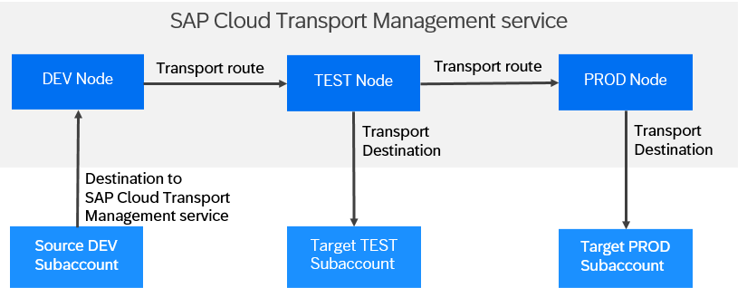
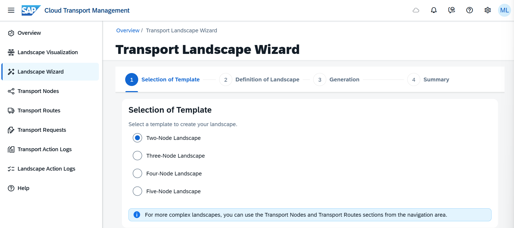
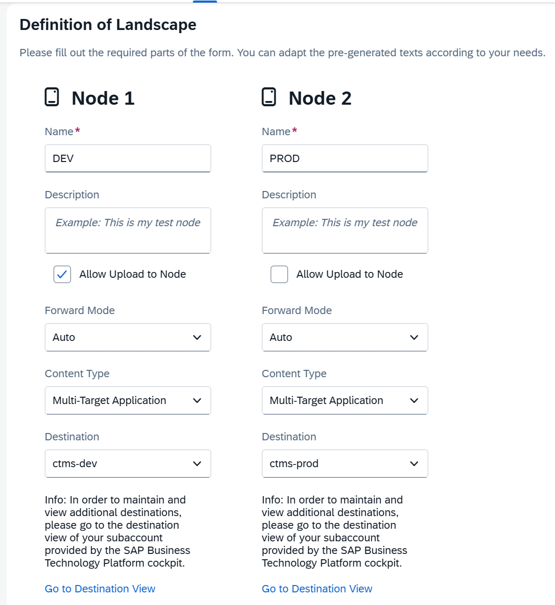
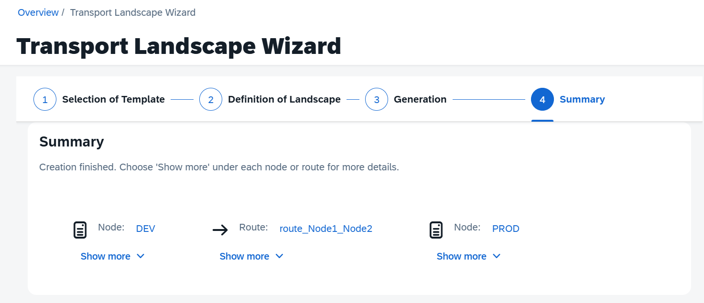

# Creating Transport Nodes and Routes in SAP Cloud Transport Management Service

Configure the transport landscape in SAP Cloud Transport Management service. This includes transport nodes as representations of the source and target endpoints of the deployment processes in the landscape, as well as transport routes to connect the transport nodes. In this tutorial, you create a source node representing your DEV subaccount, and a target node representing your PROD subaccount.

## Procedure

In your subaccount, choose **Services > Instances and Subscriptions** (1). In the **Subscriptions** section, choose the **Cloud Transport Management** link or the _Go to Application_ icon to the right of it (2).

In a new tab, you should now see the **Overview** page of your **SAP Cloud Transport Management** service instance. Currently, it looks quite empty which is expected from a new instance.

### Selection of Template

1.  On the menu, select **Transport Landscape Wizard**. Under _Selection of Template_, select the number of transport nodes of which your landscape will consist. For this workshop, select **Two-Node Landscape**.

    A transport node represents the source or the target end point of a deployment process - for example, a source \(DEV\) and a target \(PROD\) space in a Cloud Foundry subaccount. If you have DEV and PRD account, you need a two-node landscape. If you have an additional TEST account, you need a three-node landscape. For an example, see [Sample Configuration Scenario](https://help.sap.com/docs/cloud-transport-management/sap-cloud-transport-management/sample-configuration-scenario-transport-of-content-archives-directly-in-another-application?locale=en-US).

    

2.  Choose _Next_.

### Definition of Landscape

1.  For each transport node, enter the data as described in the table below.

| Field                  | Description                                                                                                                                                                                     |
| ---------------------- | ----------------------------------------------------------------------------------------------------------------------------------------------------------------------------------------------- |
| _Name_                 | Enter a name of the node. The name is case-sensitive.                                                                                                                                           |
| _Description_          | Enter a description.    **Note:** This field is optional.                                                                                                                                 |
| _Allow Upload to Node_ | Enable file uploads to this node. Required for local file transport or API uploads.                                                                                                             |
| _Forward Mode_         | Defines automatic forwarding behavior:  - _Auto_ (default): forwards the uploaded package to the next Node automatically.  - _Manual_: no automatic forwarding; manual action required |
| _Content Type_         | For **target** nodes, select content type: - Application Content - Multitarget Application (MTA) - BTP ABAP - XSC Delivery Unit   **Note:** Not required for source nodes     |
| _Destination_          | For **target** nodes, select the destination used for import. Can create via _Destination View_ in SAP BTP Cockpit.                                                                             |

---

2.  **Optional:** Change the generated names of the transport routes so that you can later identify your transport routes, and enter descriptions.

    For more information, see [Create Transport Routes](https://help.sap.com/docs/cloud-transport-management/sap-cloud-transport-management/create-transport-routes?locale=en-US).

3.  Choose _Next_.

    The next screen shows the steps involved in the generation of the transport landscape.

### Summary

1.  Choose _Summary_.

    On the _Summary_ screen, you see a summary of the transport nodes and transport routes that you created. You can directly go to the nodes or transport routes that you created through the links provided in the _Summary_.

2.  To close the wizard, choose _Finish_.
