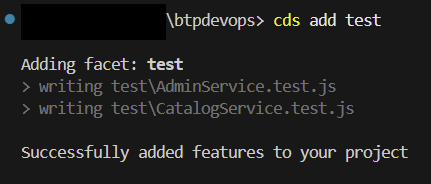
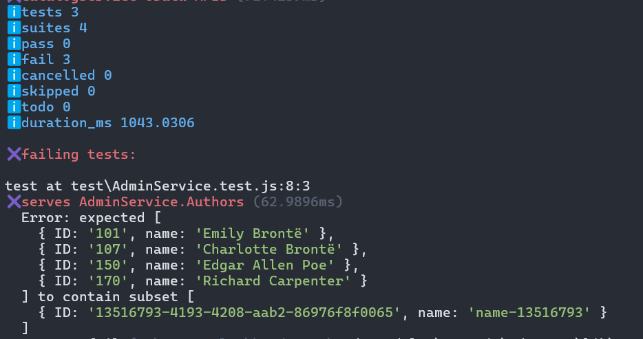

# CAP cds.test

The `cds.test` library provides best practice utils for writing tests for CAP Node.js applications.

You can use the function `cds.test()` to easily launch and test a CAP server. You can test all services programmatically using the respective [Node.js Service APIs](https://cap.cloud.sap/docs/node.js/core-services), or, test all HTTP APIs directly calling the endpoints which better represents real usage of your apps.

To add initial template tests based on the services defined in the project, you can execute $ `cds add test` in the terminal. It will create 1 test file per service definition.



A new entry will be added to `scripts` in the `package.json`.

```json
{
  "scripts": {
    ... // other scripts already created
    "test": "node --test"
  },
}
```

Run the new `test` script to execute all the test files available in the project: $ `npm test`

The test run should fail, the errors will be reported in the console. You should see the failing tests, the expected values and a stack trace for the errors.



## SAP Continuous Integration and Delivery Configuration

In the Additional Unit Tests stage, the tests you've implemented are executed.

Choose + (Add) to add an `npm Script`.

In the `npm Script` text field, enter the name of the test script from the `scripts` section to be executed.
