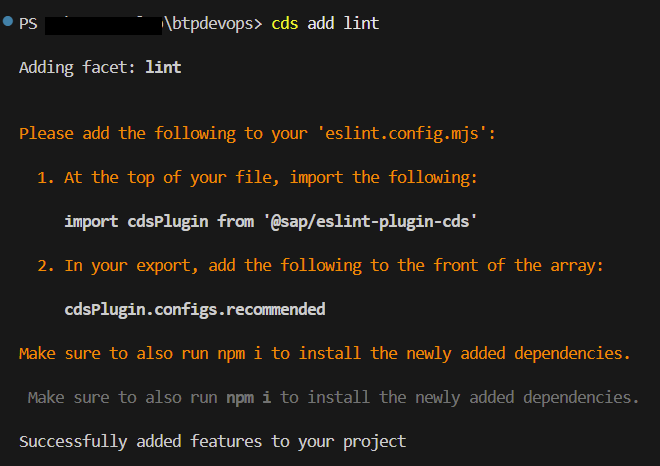
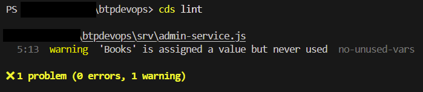

# Linting

Linting is the automated process of scanning source code to flag programming errors, bugs, stylistic inconsistencies, and suspicious constructs. It is a form of static code analysis (meaning the code is checked without actually executing it) performed by a tool called a "linter".

ESLint is the most famous linter for JavaScript/Node.js. It can be used in SAP Fiori/UI5 and CAP projects.

In the terminal, execute $ `cds add lint` to add ESLint and the ESLint plugin for CAP/CDS.



Now, you need to create the configuration file where the ESLint rules can be configured. Rules can be imported and reused from shared projects.

Create the file `eslint.config.mjs` in the root folder.

```js
import { defineConfig } from "eslint/config";
import cds from "@sap/cds/eslint.config.mjs";

export default defineConfig([
  ...cds.recommended,
  {
    ignores: ["docs/"],
  },
]);
```

With the configuration created, you can execute ESLint to check your codebase.

In the terminal, execute $ `cds lint`. You should see a warning message saying a variable was declared, but never used. This rule could be configured to throw an error rather than just a warning. It could also be completely turned off.



Now, to execute it in the CI/CD pipeline created before, you need to create a script, just like the `start`, `build`, etc, in the `package.json` file. The script **must** be named `ci-lint`.

Create a new script entry:

```json
{
  "scripts": {
    ... // other scripts already created
    "ci-lint": "cds lint"
  },
}
```

## SAP Continuous Integration and Delivery Configuration

### Lint Check

Now, you need to enable the `Lint Check` in the `SAP Continuous Integration and Delivery` service. If you want your build to fail if it reveals any errors, check the `Fail on Error` checkbox.

Go back to the `SAP Continuous Integration and Delivery` service. On the `Jobs` tab, select the previously created job.


Then, click on the `Edit` button.


Go to `Stages`, then `Build` stage. Let's activate `Lint Check`.

Click on the `+` (Add) button next to `Lint Check`.


Check the flag `Fail on Error` if you want to stop the `build` process when an error occurs during the linting process.


Click on the `Save` button.

Now, the linting script implemented in the project will be executed as part of the CI/CD pipeline.
